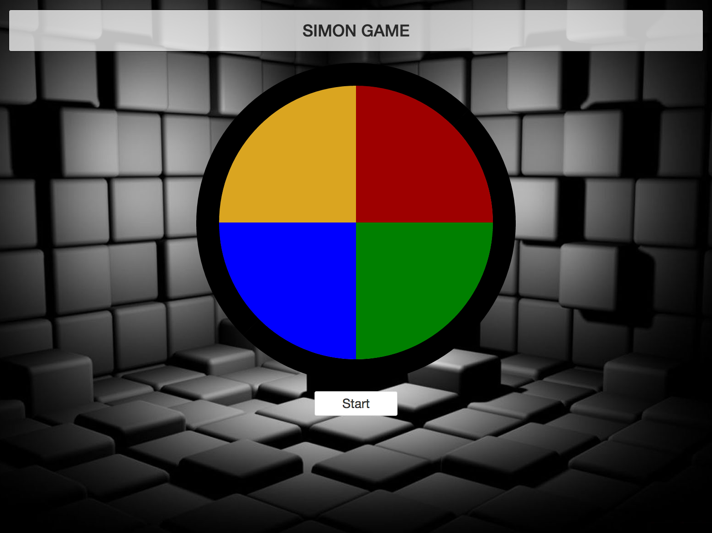

# Simon
Version 0.1.0: October 7, 2016

by [Karen Freeman-Smith](https://github.com/karenfreemansmith) and [Amber Farrington](https://github.com/NWShadowDev/)

## Description
Epicodus JavaScript week 1 project to build a simon game

### Specifications
Shows colors and player will copy sequence of colors. Each turn adds one more color.

## Support & Contact
For questions, concerns, or suggestions please email karenfreemansmith@gmail.com or amberf0712@outlook.com

## Known Issues
* N/A

## Technologies Used
HTML, CSS, JavaScript, Node.js, NPM, Gulp, Browserify, Uglify, Concat, and more!
## Legal
*Licensed under the GNU General Public License v3.0*

Copyright (c) 2016 Copyright _Karen Freeman-Smith & Amber Farrington_ All Rights Reserved.
